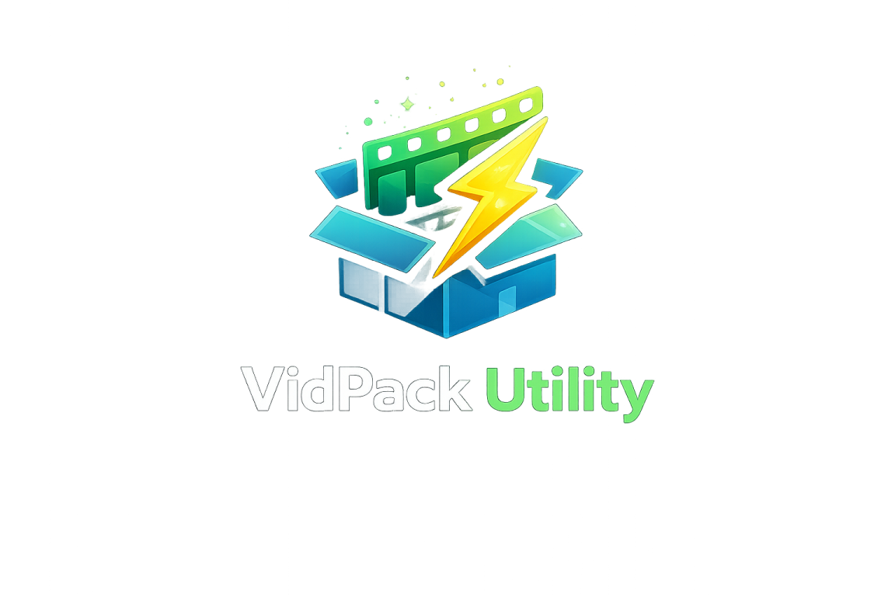
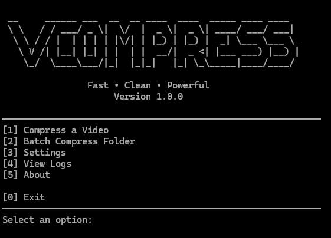
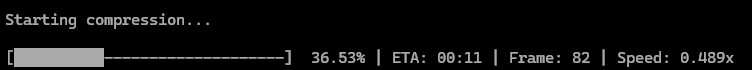

<p align="center">
  
</p>

<p align="center">
  
</p>

<p align="center">
  
</p>

<p align="center">
<b>Fast • Clean • Powerful</b>
</p>

<p align="center">


</p>

**Fast • Clean • Powerful**

VidPack Utility is a lightweight command-line application powered by **FFmpeg** that compresses videos while maintaining excellent visual quality.

Whether you need to reduce the size of a single video or compress an entire folder, VidPack Utility provides a fast, simple, and reliable workflow with live progress tracking and detailed compression logs.

---

# 📥 Download

Download the latest Windows release here:

➡️ **https://github.com/Shin3i-prproj/VidPack-Utility/releases/latest**

### Requirements

- Windows 10/11
- FFmpeg
- FFprobe

> **Note:** FFmpeg must currently be installed and available in your system PATH.

---

# ✨ Features

- 📹 Single video compression
- 📁 Batch folder compression
- 📂 Automatic output management
- ⚡ Three compression presets
  - Light
  - Balanced
  - Maximum
- 📊 Live progress bar with ETA
- 📝 Compression logs
- ⚙️ Persistent settings
- 🛡️ Error handling
- 💻 Cross-platform terminal support

---

# 📷 Preview

### Main Menu



### Compression Progress



---

# 💡 Why VidPack Utility?

- Lightweight and easy to use
- Built with Python and FFmpeg
- No unnecessary dependencies
- Real-time compression progress
- Clean command-line interface
- Batch processing support

---

# 🎞 Supported Formats

VidPack Utility supports any format FFmpeg can read, including:

- MP4
- MKV
- AVI
- MOV
- WMV
- FLV
- WebM
- M4V
- and many more...

---

# 🚀 Installation

Clone the repository:

```bash
git clone https://github.com/Shin3i-prproj/VidPack-Utility.git
cd VidPack-Utility
```

Copy the example configuration:

```bash
cp config.example.json config.json
```

On Windows, simply duplicate `config.example.json` and rename the copy to `config.json`.

Install dependencies:

```bash
pip install -r requirements.txt
```

Run the application:

```bash
python launcher.py
```

---

# 🎯 Compression Presets

| Preset | CRF | Speed |
|---------|----:|--------|
| Light | 23 | Fast |
| Balanced | 28 | Medium |
| Maximum | 32 | Slow |

---

# 🗂️ Project Structure

```text
VidPack Utility

launcher.py

app/
├── about.py
├── compressor.py
├── config.py
├── engine.py
├── exceptions.py
├── logs.py
├── menu.py
├── presets.py
├── progress.py
├── utils.py
└── version.py
```

---

# ⚠ Known Limitations

- Hardware acceleration is not yet supported.
- FFmpeg must currently be installed separately.
- Custom compression settings are planned for a future release.
- A graphical user interface (GUI) is planned for v2.0.

---

# 🛣️ Roadmap

## v1.1

- Hardware acceleration (NVENC / Intel Quick Sync / AMD AMF)
- Automatic FFmpeg detection or bundled FFmpeg
- Better compression logs
- Custom CRF selection

## v1.2

- Custom presets
- Compression preview
- Additional output formats
- Audio bitrate selection
- Recursive folder scanning

## v1.3

- Drag-and-drop support
- Queue management

## v2.0

- Graphical User Interface (GUI)
- Theme support
- User-defined presets

---

# 📄 License

This project is licensed under the **MIT License**.

---

# 👤 Author

**Shin**

If you found this project useful, consider ⭐ starring the repository.
